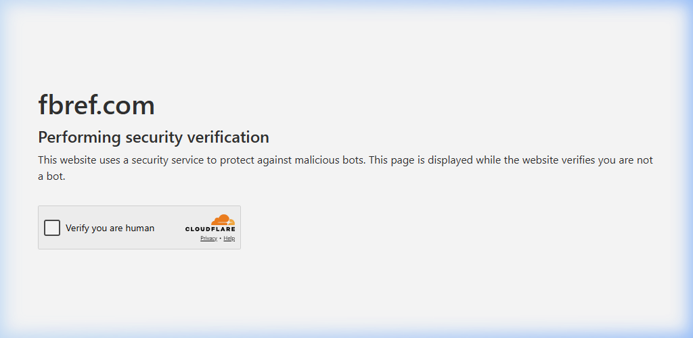

# ⚽ Predict-Football-Match-Winners



### 🏆 Transform Football Data into Winning Insights

A production-grade Machine Learning platform that predicts the outcomes of Premier League matches. This system handles everything from automated data collection and professional-grade engineering to real-time AI predictions.

---

## 🌟 What does this project do? (For the Average User)
Imagine having a digital scout that has watched every single Premier League match since 2020. This program:
1.  **Gathers Data**: Automatically pulls the latest match results and team statistics from official league sources.
2.  **Learns**: It analyzes patterns—like how a team performs when playing away, their scoring momentum, and defensive stability.
3.  **Predicts**: It gives you a "Win Probability" for upcoming matches based on 4+ years of historical performance.
4.  **Visualizes**: Everything is controlled via a sleek **Mission Control Dashboard** where you can filter by your favorite team and see the AI's success rate.

---

## 🏗️ The Tech Stack (For the Engineers)
This system is built using a modern **Data Engineering + ML Ops** architecture:

*   **Data Layer**: PostgreSQL (Postgres) structured into Bronze (Raw), Silver (Cleaned), and Gold (Feature Store) layers.
*   **Orchestration**: **Prefect** manages the automated pipeline workflows.
*   **AI Engine**: **XGBoost Classifier** with dynamic rolling average feature engineering.
*   **Experiment Tracking**: **MLflow** tracks every model version, metric, and hyperparameter.
*   **Inference API**: **FastAPI** serves the predictions via high-performance REST endpoints.
*   **Control Center**: **Tkinter** desktop GUI for full system management.
*   **Infrastructure**: **Docker & Docker-Compose** for containerized database and tracking services.

---

## 🚀 Getting Started

### 1. 🛠️ One-Time Setup
Ensure you have Docker and Python 3.10+ installed, then run:
```powershell
pip install -r requirements.txt
docker-compose up -d
```

### 2. 🛰️ Launch Mission Control
The easiest way to interact with the system is through the GUI:
```powershell
python scripts/gui_results.py
```
*   Click **"Run Full Pipeline"** to download the latest 2024 data and train the AI.
*   Filter by **Team** or **Season** to see the results.

### 📊 Advanced: View ML Tracking
Monitor your model's performance in real-time at:
[http://localhost:5000](http://localhost:5000)

---

## 📂 Project Structure
*   `ingestion/`: Automated scrapers and data loaders.
*   `transformation/`: Feature engineering and data cleaning.
*   `models/`: ML training logic and hyperparameter tuning.
*   `api/`: Production prediction service.
*   `pipelines/`: Automated workflow orchestration.
*   `scripts/`: Utility scripts and GUI Dashboard.

---

### 👨‍💻 Author
**Abinan Jeyaratnam**
*A production-grade ML solution for football analytics.*
